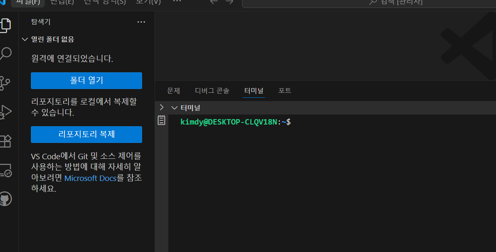
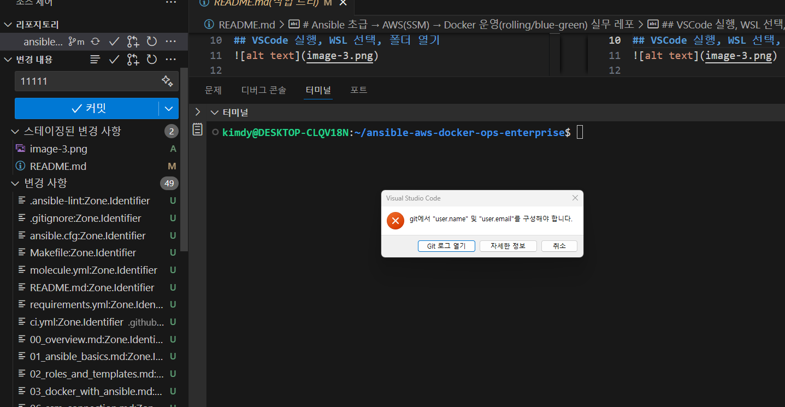

# Ansible 초급 → AWS(SSM) → Docker 운영(rolling/blue-green) 실무 레포

## VSCode 에서 WSL 사용


### WSL 연결 또는 Linux 설치 없을 경우 배포판을 사용하여 설치 후 연동
### 목록 중 연결닫기 하면 다시 윈도우 파워 셸

## 윈도우즈에서 현재의 프로젝트 폴더를 WSL 의 Linux 폴더로 복제
## VSCode 실행, WSL 선택, 폴더 열기

## WSL 환경의 Git 재설정 필요

```
git config --global user.name "당신의 이름 또는 닉네임"
git config --global user.email "github에 등록된 이메일@example.com"
```

이 레포는 **Ansible 초급자**가 다음까지 “레포 형태로” 실습하면서 익히도록 구성했습니다.

- Ansible 기본(인벤토리/변수/템플릿/핸들러/Role)
- **Docker 엔진 설치 + Compose 스택 배포**
- **Rolling 배포(멀티 호스트)**: `serial: 1` 방식으로 한 대씩 업데이트 + 헬스체크
- **Blue-Green 배포(단일 호스트)**: inactive 스택 업데이트 → 헬스체크 → nginx 업스트림 스위치
- **AWS 운영(SSH 없이)**: EC2를 **SSM Session Manager**로 접속/자동화(SSH 포트 오픈 불필요)

> 권장 환경: Linux / macOS / Windows(WSL)

## 0) 설치

```bash
./scripts/bootstrap.sh
./scripts/check.sh
```

## 1) 로컬에서 플레이북 실행 확인

```bash
ansible -i inventories/dev/hosts.ini all -m ping
ansible-playbook -i inventories/dev/hosts.ini playbooks/00_ping.yml
```

## 2) Docker 엔진 설치 → Compose 배포

```bash
ansible-playbook -i inventories/dev/hosts.ini playbooks/10_docker_engine_install.yml
ansible-playbook -i inventories/dev/hosts.ini playbooks/11_deploy_stack.yml
```

## 3) Rolling 배포(멀티 호스트)

```bash
ansible-playbook -i inventories/prod/hosts.ini playbooks/12_deploy_stack_rolling.yml
```

## 4) Blue-Green 배포(단일 호스트)

```bash
ansible-playbook -i inventories/dev/hosts.ini playbooks/13_blue_green_switch.yml
```

## 5) AWS (SSM 기반, SSH 없이)

- 문서: `docs/06_ssm_connection.md`

원샷 프로비저닝(EC2 생성 + SSM 역할/프로파일 + 태그):

```bash
ansible-playbook playbooks/20_aws_provision_ssm_no_ssh.yml \
  -e aws_region=ap-northeast-2 \
  -e environment=dev

ansible-inventory -i inventories/aws/aws_ec2.yml --graph
```

SSM로 구성/배포(SSH 없이):

```bash
ansible-playbook -i inventories/aws/aws_ec2.yml playbooks/21_post_provision_via_ssm.yml
```

정리(비용 방지):

```bash
ansible-playbook playbooks/23_aws_cleanup.yml -e aws_region=ap-northeast-2 -e environment=dev
```

---

자세한 단계별 가이드는 `docs/`를 참고하세요.
